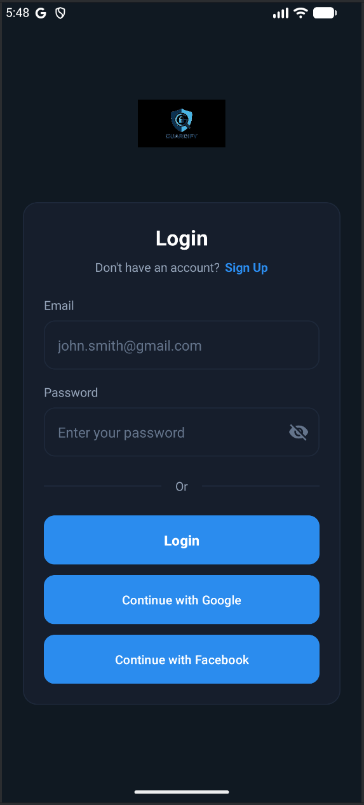
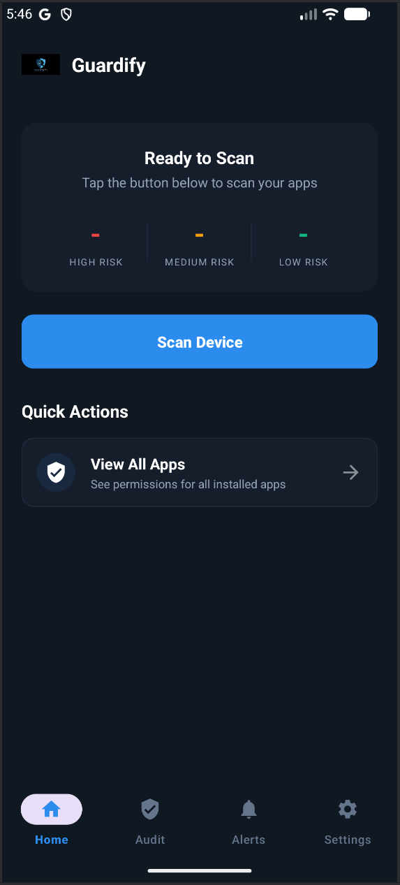
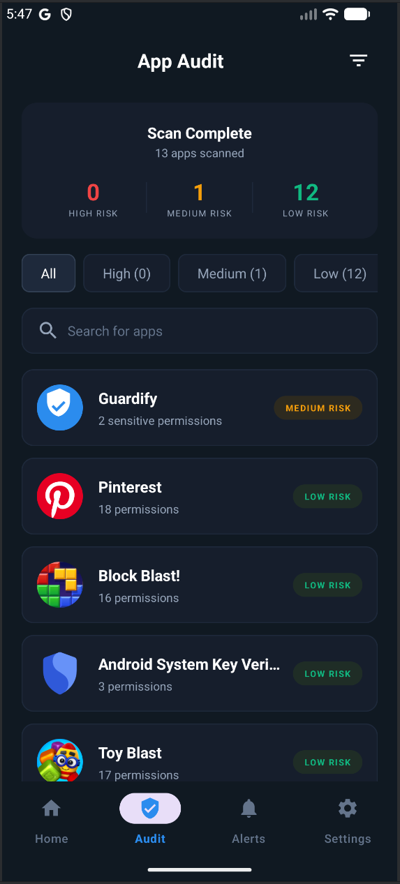
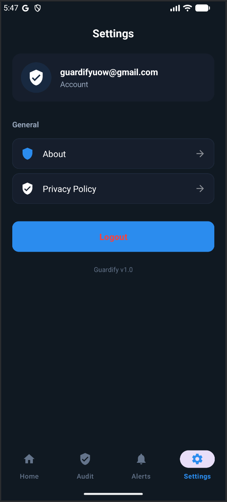

<p align="center">
  
</p>

<h1 align="center">Guardify</h1>

<p align="center">
  <strong>Your Apps, Your Control.</strong>
</p>

<p align="center">
  <a href="#features">Features</a> •
  <a href="#screenshots">Screenshots</a> •
  <a href="#download">Download</a> •
  <a href="#installation">Installation</a> •
  <a href="#tech-stack">Tech Stack</a> •
  <a href="#license">License</a>
</p>

<p align="center">
  
  
  
  
</p>

---

## 📱 About

**Guardify** is a comprehensive privacy guard application for Android that helps users understand and control what permissions their installed apps have access to. In an era where apps often request more permissions than they need, Guardify empowers users to take back control of their privacy.

---

## ✨ Features

### 🔍 **Permission Auditing**
- Scans all installed apps for granted permissions
- Categorizes permissions into **Privacy Critical** and **Standard Access**
- Shows only permissions apps **actually have**, not just what they request

### 🎯 **Risk Classification**
- Automatically classifies apps as **High**, **Medium**, or **Low** risk
- Risk assessment based on sensitive permission combinations
- Visual indicators for quick identification

### 🕵️ **Tracker Detection**
- Integrates with [Exodus Privacy API](https://exodus-privacy.eu.org/)
- Identifies known trackers embedded in apps
- Helps you understand which apps are tracking you

### 📊 **Data Usage Monitoring**
- Track how much data each app consumes
- View mobile and WiFi usage separately
- Monitor apps with suspicious network activity

### 🛡️ **Security Scanning**
- Animated security scan with progress visualization
- Comprehensive device audit
- One-tap security overview

### 🔐 **User Authentication**
- Secure login with Firebase Authentication
- Google Sign-In support
- Password recovery options

---

## 📸 Screenshots

<p align="center">
  
  
  
  
</p>

<!-- 
Uncomment and add your screenshots:

<p align="center">
  
  
  
  
</p>

<p align="center">
  
  
  
</p>
-->

---

## 📥 Download

### Latest Release

<p align="center">
  <a href="https://github.com/codenamec0de/guardify/releases/latest">
    
  </a>
  <a href="https://github.com/codenamec0de/guardify/archive/refs/heads/main.zip">
    
  </a>
</p>

| Version | Release Date | Download |
|---------|--------------|----------|
| v1.0.0  | March 2026   | [APK](https://github.com/codenamec0de/guardify/releases/download/v1.0.0/guardify-v1.0.0.apk) • [Source](https://github.com/codenamec0de/guardify/archive/refs/tags/v1.0.0.zip) |

---

## 🚀 Installation

### Option 1: Install APK Directly

1. Download the latest APK from [Releases](https://github.com/codenamec0de/guardify/releases/latest)
2. Enable **Install from Unknown Sources** in your device settings
3. Open the downloaded APK file
4. Tap **Install**

### Option 2: Build from Source

```bash
# Clone the repository
git clone https://github.com/codenamec0de/guardify.git

# Navigate to project directory
cd guardify

# Open in Android Studio and sync Gradle
# Or build via command line:
./gradlew assembleDebug
```

The APK will be generated at:
```
app/build/outputs/apk/debug/app-debug.apk
```

---

## 🔧 Configuration

### Firebase Setup

1. Create a project in [Firebase Console](https://console.firebase.google.com/)
2. Add an Android app with package name: `com.uow.guardify`
3. Download `google-services.json` and place it in the `app/` directory
4. Enable **Email/Password** and **Google Sign-In** in Firebase Authentication

### Required Permissions

The app requires the following permissions to function:

| Permission | Purpose |
|------------|---------|
| `QUERY_ALL_PACKAGES` | Scan installed applications |
| `INTERNET` | Firebase auth & Exodus API |
| `PACKAGE_USAGE_STATS` | Data usage monitoring |
| `READ_SMS` *(optional)* | Scam message detection |

---

## 🛠️ Tech Stack

<p align="center">
  
  
  
  
</p>

- **Language:** Kotlin 1.9.0
- **Min SDK:** 26 (Android 8.0)
- **Target SDK:** 34 (Android 14)
- **Architecture:** MVVM with Coroutines
- **Authentication:** Firebase Auth (Email + Google)
- **Networking:** Retrofit + OkHttp
- **UI:** Material Design 3 + Custom Dark Theme
- **API Integration:** Exodus Privacy API

---

## 📁 Project Structure

```
app/
├── src/main/
│   ├── java/com/uow/guardify/
│   │   ├── adapter/          # RecyclerView adapters
│   │   ├── api/              # Retrofit API services
│   │   ├── model/            # Data models
│   │   ├── ui/               # Fragments (home, audit, alerts, settings)
│   │   ├── util/             # Helper classes
│   │   ├── LoginActivity.kt
│   │   ├── MainActivity.kt
│   │   ├── ScanActivity.kt
│   │   ├── AppDetailActivity.kt
│   │   └── ...
│   └── res/
│       ├── layout/           # XML layouts
│       ├── drawable/         # Vector icons & backgrounds
│       ├── values/           # Colors, strings, themes
│       └── anim/             # Transition animations
└── google-services.json      # Firebase config (add your own)
```

---

## 🔒 Privacy

Guardify is built with privacy in mind:

- **No data collection** — All scanning happens locally on your device
- **No tracking** — We don't track your usage or behavior
- **Open source** — Full transparency in how the app works
- **Minimal permissions** — We only request what's necessary

---

## 🤝 Contributing

Contributions are welcome! Feel free to:

1. Fork the repository
2. Create a feature branch (`git checkout -b feature/amazing-feature`)
3. Commit your changes (`git commit -m 'Add amazing feature'`)
4. Push to the branch (`git push origin feature/amazing-feature`)
5. Open a Pull Request

---

## 📄 License

This project is licensed under the MIT License - see the [LICENSE](LICENSE) file for details.

```
MIT License

Copyright (c) 2026 Guardify

Permission is hereby granted, free of charge, to any person obtaining a copy
of this software and associated documentation files (the "Software"), to deal
in the Software without restriction, including without limitation the rights
to use, copy, modify, merge, publish, distribute, sublicense, and/or sell
copies of the Software, and to permit persons to whom the Software is
furnished to do so, subject to the following conditions:

The above copyright notice and this permission notice shall be included in all
copies or substantial portions of the Software.
```

---

## 🙏 Acknowledgements

- [Exodus Privacy](https://exodus-privacy.eu.org/) for tracker detection API
- [Firebase](https://firebase.google.com/) for authentication services
- [Material Design](https://m3.material.io/) for design guidelines

---

<p align="center">
  <b>Made with ❤️ for privacy</b>
</p>

<p align="center">
  <a href="https://github.com/codenamec0de/guardify/issues">Report Bug</a> •
  <a href="https://github.com/codenamec0de/guardify/issues">Request Feature</a>
</p>
